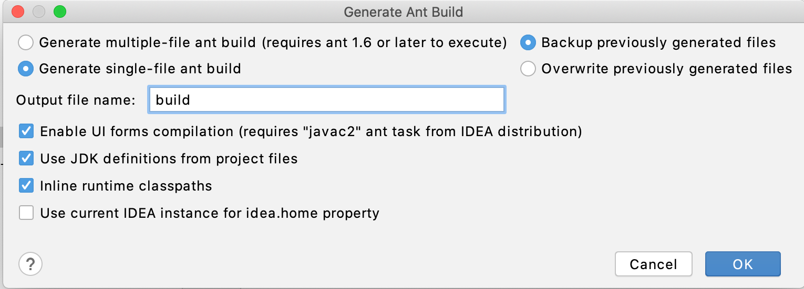

# Ant Build in Android Studio
This tutorial shows how to start an Ant build for an Android project inside Android Studio.

## STEP 1 Install Plugin
You can search the `Ant Build Generation` plugin from the plugin market in Android Studio.

Install the plugin and restart the Android Studio.

## STEP 2 Initilize a `build.xml` file
Next, we use `Build->Generate Ant Build...`. In the popup, configure the output as follows:

1. the output file is `build`;
2. Select `Generate single-build ant file`;
3. Click `OK`;

Please also reference the attached image;
.

